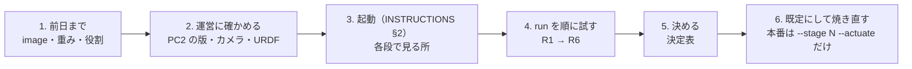
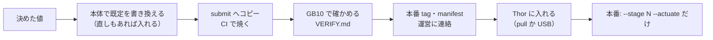

# 接続テスト（09-27）の手順 — Team RAMEN

接続テストでやることは 2 つです。

1. 会場の機材（運営の PC2・WBC・adapter と実機）で、私たちの image が最後まで動くかを確かめる。
2. **迷っている設定を、実機で試して決める。** 決めた値はコードの既定にして焼き直し、**大会本番は
   `--stage N --actuate` だけで動かす**（引数が多いと本番で間違えるため）。

起動のしかた（Step 0〜5）は `INSTRUCTIONS.md` の §2 を使います。この手順書は「何を、どの順に試し、何を見て、どう決めるか」だけを書きます。

## 1. 前日まで

- [ ] **使う image を決め、Thor に入れる。** `manifest.yaml` の `images.thor` の digest で pull するか、USB から `docker load`（`WEIGHTS.md` §3・§4）。
- [ ] **使うのは `20260926-rebuild4`（digest `sha256:0cf460af…`、本体 `9965c90`）だけ。** 既定は **joint lane**・手首 roll の clamp **off**
  （運営の最新 package `497f3ab` に合わせた、本体 #170）。この手順書はこの image 用。古い image（`20260925-rebuild3` など）は GHCR と USB から消した。
  Thor に古い image が残っていても使わない（既定の送り方が違い、R1b・R4 の option も無い）。`docker image inspect <image> --format '{{.Id}}'` が
  USB の `IMAGE_ID.txt` と一致するかで確かめる。
- [ ] **重み**: Thor で `prefetch_weights.py --check` が `all present`（`WEIGHTS.md` §4）。
- [ ] **役割を決める**:
  - Thor を操作する人（Enter 1 / Enter 2）
  - PC2 を操作する人（WBC・adapter・go-live）
  - E-stop を持つ人（ロボットの横から離れない）
  - 記録する人（§7 の表）
- [ ] この手順書と `INSTRUCTIONS.md` を手元に（印刷か別の画面）。

## 2. 運営に確かめる（ロボットを動かす前に）

PC2 の中を読むときは、必ず運営に断ってからにします。

| # | 確かめること | どう見るか | よくないとき |
|---|---|---|---|
| 2-1 | PC2 の運営のプログラムを、誰が起動するか | 運営に聞く。README は「You do not run any of this」、RUNBOOK は「you run the whole pipeline yourself」と食い違っている | 運営の指示に従う。起動の順番（`INSTRUCTIONS.md` §2）は変えない |
| 2-2 | **PC2 の運営 package の版** | PC2 で `git -C <package> log -1 --format='%h %ci'`（git で入れていなければ運営に聞く）。**`609f61d`（2026-09-25）以降か** | 古いと、頭の画像が潰れる（2-3）、WBC の起動時に腕が動く（§3 の Step 2）、**joint lane が無いので既定のままでは腕が動かない**（go-live 待ちのまま）。R2・R3 は飛ばし、R4（`--boundary-lane pose --wrist-roll-clamp on`）で通す。運営に更新を頼む |
| 2-3 | 頭カメラが 1280x480 で出ているか | bridge の起動 log が `head camera live at 1280x480`。`HEAD_ALLOW_RESIZE_FALLBACK=1` が付いていない | **こちらでは補正しない。** 運営に直してもらう（`9e32910` 以降の bridge なら、1280x480 以外では頭の画像を出さずに ERROR になる） |
| 2-4 | 運営 IK の URDF | PC2 で `md5sum ~/g1_bridge/robot/assets/g1_urdf/g1_29dof_with_hand.urdf` が `093c36ba3284c6cce5f2b62041626b79` | 違えば運営 IK の運動学が変わっている。pose lane で動かす前に運営に確かめる |
| 2-5 | manifest に PC2 用の image が無くてよいか | 運営に聞く | — |

## 3. 起動（`INSTRUCTIONS.md` §2 の Step 0〜5）と、各段で見る所

| Step | 見る所（記録する） |
|---|---|
| 1 bridge | 2-3 の log。`:5557` のレート |
| 2 WBC | **腕が台や物に届かない所で起動する。** 新しい wrapper なら、腕は実測の姿勢のまま動かない。`[seed] WARNING: falling back to STOCK start-up` が出たら古い動き（2 秒で肩 roll ±0.2 の姿勢へ）。安定した保持状態になってから次へ |
| 3 adapter（試運転） | `[stats]` の行が出ること |
| 4 Thor | 読み込みの秒（Stage 1〜4 は Enter 1 まで 4〜5 分の目安）、`vlm_latency`（5 秒以内でないと止まる）、`[groot] integrated GPU: … MemAvailable=…`、`sender clock offset ~ …`、`[init] policy variants: …`、`[boundary] JointSink (joint lane)`（既定。pose lane なら `DecoupledSink (pose lane)` と `wrist_roll clamp: off` / `on`） |
| Enter 1 → go-live 待ち | 両肩を −0.05 rad 動かす指令。go-live 前にロボットが揺れないか |
| 5 go-live（人が打つ） | go-live から動き出すまでの時間。adapter の `[stats]` で stale が 0 か |

- 困ったときの表示の意味は `INSTRUCTIONS.md` §4 にあります。
- **止めるとき**: 危ないと思ったら E-stop。そうでなければ Thor で Ctrl+C（手を開いて腕を下ろしてから終わる）。2 回目の Ctrl+C は、戻すのをやめてすぐ解放する。

## 4. 試す run（上から順に。前の run で問題があれば、次へ進む前に止まって相談）

1 run は 5〜10 分（読み込みを含む）かかります。時間が足りなければ **R1 → R2 → R3 → R5** を優先します。
2-2 が `609f61d` より前なら、R2・R3 の代わりに R4 を通します（R5 も R4 と同じ option で）。

| # | stage | 足す option | 目的 | 見る所 |
|---|---|---|---|---|
| **R0** | —（ロボット無し） | — | 運営の適合試験 | Thor で conformance（`INSTRUCTIONS.md` §5）が `PASS`。**本番の run を動かしていないとき**に行う（`:5555`〜`:5557` を使うため） |
| **R1** | 0 | なし（既定） | 歩いて pick の開始姿勢まで | go-live の後に腕を下ろす → `[setup] measured lowered arm pose latched` → 台まで歩く → 止まって手を開く → pick の開始姿勢 |
| R1b | 0 | `--walk-lowering-check converged` | **R1 が歩く前に止まったときだけ** | R1 の止まり方が `lowering the arms before the walk failed` か `not in the lowered walk envelope` のとき。`[setup] WARNING: lowered arms are outside the walk envelope (…)` のどの関節が外れたかを記録し、歩けるか |
| **R2** | 1（脚 1 本目） | なし（既定 = joint lane） | 今の既定の形で 1 本通す（2-2 が 609f61d 以降のときだけ） | 台を回す → pick（VLM が答えるか、握れるか、持ち替え）→ insert → 締め付け。Enter 2 の問い（下の注）。`[orch] … timed out short of its target` の行の数。開始姿勢への到達（`joint_error`）、動きが学習どおりに見えるか、adapter の `[stats]` に joint の受信が数えられるか、URDF の clamp の log が多すぎないか |
| **R3** | 1 | `--boundary-lane pose` | 手先の姿勢で送る形（運営 IK を通る。2-2 が 609f61d 以降のときだけ） | R2 と同じ所を比べる。開始姿勢への到達（`ee_pos_error`）、adapter の IK の失敗（reject）の多さ、締め付け（手首 roll を大きく使う）で腕が止まらないか。起動 log の `[boundary] wrist_roll clamp: off …` |
| R4 | 1 | `--boundary-lane pose --wrist-roll-clamp on` | **2-2 が 609f61d より前のときだけ**（古い運営 IK の手首 roll ±0.9 の上限に合わせる） | R2 の見る所と同じ。起動 log の `[boundary] wrist_roll clamp: on …` |
| **R5** | 5 | R2・R3 で良かった方の送り方（joint なら option なし） | flip | 開始姿勢 → Enter 2 → 裏返す |
| R6 | 2 など | `--policy-variant-set all6_400k` | 候補の model（時間があれば） | 既定の model と比べて明らかに良いか |

**Enter 2 の問い（policy を始める前）の読み方**
- 届いていれば `[gate] … initial arm/hand pose is reached (…)`、届いていなければ `[gate] WARNING: … initial arm pose is NOT reached (…)` と、一番ずれた量が出る
  （joint lane は関節角の `worst=… error=…rad`、pose lane は手先の `ee_pos_error=…m`）。**どちらでも、押す前に腕が開始姿勢にあるかを目で確かめる。**

## 5. 決める（決定表）

| 決めること | 選択肢 | 決め方 |
|---|---|---|
| 指令の送り方（`--boundary-lane`） | `joint`（今の既定）/ `pose` | 2-2 が 609f61d 以降で、R2 が開始姿勢に届き、腕が止まらず、動きが学習どおりなら `joint` のまま。R2 が怪しく R3 の方が良ければ `pose`。2-2 が古ければ `pose` |
| 手首 roll の clamp（`--wrist-roll-clamp`、pose lane のときだけ効く） | `off`（今の既定）/ `on` | 2-2 が 609f61d より前（古い運営 IK）のときだけ `on`。それ以外は `off` のまま |
| Stage 0 の下ろした腕の確かめ方（`--walk-lowering-check`） | `joint`（今の既定）/ `converged` | R1 が歩く前に止まり、R1b で歩けたときだけ `converged`。R1 で歩ければ `joint` のまま |
| model（`--policy-variant-set`） | 既定 / `all6_400k` | R6 で明らかに良かったときだけ切り替える。試さなければ既定のまま |
| GPU に載せる model の数（`--gpu-models`） | `all`（今の既定）/ `2` | 読み込みでメモリが足りずに止まったときだけ `2` |

直す必要があるもの（上の選択肢では済まない問題）は、§7 の表に「直す」と書いて、ログの場所と一緒に持ち帰ります。

## 6. 決めた後

- 書き換える所:
  - 送り方と手首 roll の clamp: 本体の `entrypoint.py` の `--boundary-lane` / `--wrist-roll-clamp` の既定
  - Stage 0 の確かめ方: `skill_config.yaml` の `skills.walk_lowered_pose.latch_check`
  - model: `policy_config.yaml` の `default_variant_by_skill`
  - GPU: 起動口 `docker/venue_entry.sh`
- `INSTRUCTIONS.md` の本番の `docker run` の行には、option を 1 つも書かない（書くのはこの手順書だけ）。
- **焼き直しが間に合わないとき**: 今の image のまま、決めた option を `INSTRUCTIONS.md` §2 Step 4 の `docker run` の行に書き込んで戦う。本番は打つのではなく、その 1 行を貼るだけにする。

## 7. 記録の表（run ごとに 1 行）

log は Thor の `$RAMEN_HOST_DIR/outputs/orch_logs/`（`orch_*.jsonl` と VLM の `vlm_*.log`）に残ります。端末の出力も、写真か copy で残してください。

| # | 時刻 | stage | 足した option | 結果（動いた / 止まった所） | 見た所のメモ | log の名前 | 直す? |
|---|---|---|---|---|---|---|---|
| R0 | | — | — | | | | |
| R1 | | 0 | — | | | | |
| R2 | | 1 | — | | | | |
| R3 | | 1 | `--boundary-lane pose` | | | | |
| R4 | | 1 | `--boundary-lane pose --wrist-roll-clamp on` | | | | |
| R5 | | 5 | | | | | |
| R6 | | | `--policy-variant-set all6_400k` | | | | |

運営に確かめたこと（§2）の答えも、ここに書き足してください。

| # | 答え |
|---|---|
| 2-1 誰が起動するか | |
| 2-2 PC2 の package の版 | |
| 2-3 頭カメラ | |
| 2-4 URDF の md5 | |
| 2-5 PC2 用の image | |

## 付録: 試す option の説明

どれも起動の `docker run … --stage N --actuate` の後ろに足すと、その run だけ切り替わります（焼き直さない。既定は変わらない）。
**大会本番では使いません**（§6 で既定にしてから本番）。

### model（`--policy-variant-set` / `--policy-variant-<slot>`）

既定の model は image の中の `policy_config.yaml`（`default_variant_by_skill`）。pick は hybrid（`groot_pick_legs_v1`）のまま。

| 足す option | 切り替わるもの |
|---|---|
| `--policy-variant-set all6_400k` | pick 以外の全部（台を回す・insert・締め付け・flip）を 6 skill 統合 RAMEN-Ori（400k）に |
| `--policy-variant-insert insert_table_leg_ramen_ori_all6_400k` | insert だけ。他は `--policy-variant-rotate-table-base` / `--policy-variant-rotate-leg` / `--policy-variant-flip` に `<skill>_ramen_ori_all6_400k` |

- 切り替え先は **`WEIGHTS.md` の一覧にある重みを使う slot だけ**（会場はネット無し。`policy_config.yaml` の `variant_sets` に書いた組み合わせは事前取得に入っている）。一覧に無い slot を指定すると、起動時に重みが無くて止まる。
- 起動 log の `[init] policy variants: insert=… (config)` で分かる（`config` = 既定、`set:…` / `cli` = 切り替え）。
- 新しい model（学習中の insert の DP など）は、本体で slot と set を足して image を焼き直してから使う。

### 指令の送り方（`--boundary-lane`）

| | joint（既定） | pose |
|---|---|---|
| 送るもの | 腕の関節角 (T,22)。運営 IK を通らない。手・歩行・骨盤高さの列は pose と同じ値 | 手先の位置と向き (T,25)。運営 IK が関節角に戻す |
| 「腕が着いたか」 | 関節角で比べる（0.10 rad） | 手先で比べる |
| 前提 | PC2 の運営 package が `609f61d` 以降（`wbc_driver.py` の `--joint-lane on` が既定）。古いと指令が無視され、go-live 待ちのまま動かない | — |

- 起動 log の `[boundary] JointSink (joint lane) bound on …` で分かる（pose なら `DecoupledSink (pose lane)`）。
- 運営のシミュレーションでは、同じ軌道で joint lane が誤差 0.05 rad 以内、pose lane は最大 0.75 rad（IK は全部成功していても）。
- 運営はまだ実機で試していない（「組み込んでよいが、本番で頼るのはまだ」）。

### 手首 roll の clamp（`--wrist-roll-clamp {on,off}`）

- pose lane で、手首 roll を運営 IK の古い上限（±0.9、余裕を見て ±0.88）に寄せるか。既定は `off`。
- 運営 IK の `a1af470`（package `609f61d`）でこの上限は無くなった。学習データは 0.9 を超える手首 roll を使うので、新しい IK なら `off` の方が学習どおりに動く。古い IK に `off` で送ると、0.9 を超えた目標でその腕が丸ごと止まる → 古い IK のときだけ `on`。
- 起動 log の `[boundary] wrist_roll clamp: on …` / `off …` で分かる（pose lane のときだけ出る）。joint lane と sdk 経路では無視される。

### Stage 0 の下ろした腕の確かめ方（`--walk-lowering-check {joint,converged}`）

- Stage 0 は go-live の後に腕を下ろしてから歩く。下ろし終わった腕を歩行中に保持する前に、`joint`（既定）は関節ごとの歩行の範囲に入っているかを確かめ、外れていれば歩かずに止める（腕を上げたまま歩かない）。
- pose lane では下ろし終わりを手先で判定し、運営 IK が同じ手先を別の関節角で作るので、範囲をわずかに外れて止まることがありうる。`converged` は、下ろす動きが収束していれば、外れた関節を log に残して実測の姿勢を保持して歩く。
- 既定の正本は `skill_config.yaml` の `skills.walk_lowered_pose.latch_check`。起動 log の `[init] walk latch check = joint (skill_config.yaml)` / `converged (cli)` で分かる。
