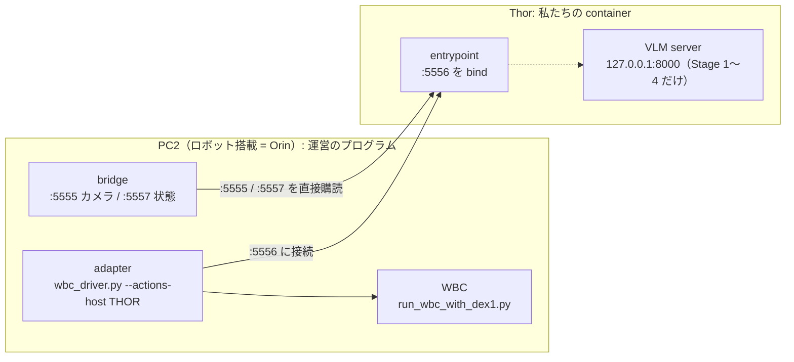
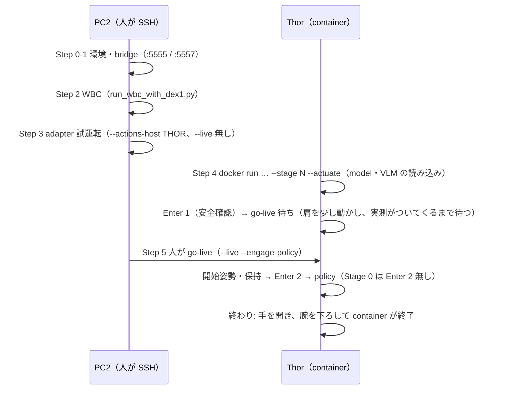

# 会場での動かし方 — Team RAMEN（Thor の image 1 つ）

会場では、運営の RUNBOOK（`iacevaltest/iros_g1_orin_package` の `docs/RUNBOOK.md`）どおり、
**全部を私たちが起動する**。PC2 では運営のプログラムだけを起動し、私たちの物は **Thor の container 1 つ**。
PC2 用の container は無い（運営 template の「PC2 の client」は使わない。理由は下の「全体の形」）。

## 0. 全体の形



- Thor の entrypoint が PC2 の `:5555` / `:5557` を**直接**読み、`:5556` は **Thor が bind** する。
  PC2 の adapter は `--actions-host <THOR_IP>` で Thor につなぐ（adapter の `--actions-host` は
  「:5556 を bind した側の host」、既定は 127.0.0.1 = PC2 自身）。
- VLM（hybrid pick の区間 1→2 の判定）は、Stage 1〜4 の run の中で container が自分で起動し、run の終わりに止める。
- container は run ごとに作り直す。重みは host の HF cache を読み取り専用で mount し、**実行中はネットに出ない**。

| Stage | 中身 | Enter |
|---|---|---|
| 0 | 準備（台まで歩く・腕・初期姿勢） | 1 回（安全確認） |
| 1〜4 | 脚 1 本ずつ: 台を回す → pick（VLM + GR00T + IK + 持ち替え）→ insert → 締め付け | 2 回（安全確認 / policy 開始） |
| 5 | 台を裏返す（flip） | 2 回 |

## 1. 事前準備（会場の前に Thor で 1 回）

```bash
# 置き場所（例）。以下の手順はこの 3 つを使う
export RAMEN_HOST_DIR=~/ramen
mkdir -p $RAMEN_HOST_DIR/{hf_cache,outputs,vlm_cache}

# image（digest は manifest.yaml の images.thor）
docker pull ghcr.io/matsuolab-llmcompe2025-team-suzuki/ikea-thor@<DIGEST>

# 重みの事前取得（ネットのある所で。会場の実行中は取りに行かない）
#   → tools/prefetch_weights.sh（一覧と使い方は script の先頭）
# 取れているかをネット無しで確かめる（--check）
```

- `vlm_cache` は VLM の compile 結果の置き場。1 回目の run だけ小さな kernel の compile が走り、2 回目以降は再利用する。
- `outputs` に run ごとの log（`orch_logs/orch_*.jsonl`、VLM の `orch_logs/vlm_*.log`）が残る。

## 2. 1 run の手順（**順番が大事**）



### Step 0〜1 [PC2] 環境とカメラ・状態の配信

RUNBOOK の Step 0（環境変数・`rt/lowcmd` を掴んでいる process が無いこと）と Step 1（`real_orin_cameras.py` と
`real_orin_state.py` の 2 本）をそのまま行う。

### Step 2 [PC2] WBC — **`run_wbc_with_dex1.py` で起動する**

```bash
conda activate g1_wbc
cd ~/GR00T-WholeBodyControl
python <運営 package の tools>/run_wbc_with_dex1.py \
  --interface real --no-with-hands --keyboard_dispatcher_type ros --no-enable-onscreen \
  --dex1-max-speed 4.2
```

- RUNBOOK の `run_g1_control_loop.py` **ではない**。それだとグリッパ（Dex1-1）を動かすものが居ない
  （`run_wbc_with_dex1.py` は同じ引数を受ける差し替えで、グリッパの指令を同じ `rt/lowcmd` に載せる）。
- `--dex1-max-speed 4.2`: 学習データのグリッパの速さ（運営の既定は 2.0）。
- `run_wbc_with_dex1.py` の PC2 上の置き場所は会場で確かめる（運営 package の `tools/` にある）。
- 安定した保持状態になってから次へ（`ros2 topic hz /G1Env/env_state_act`）。

### Step 3 [PC2] adapter の試運転（まだ `--live` を付けない）

```bash
conda activate g1_wbc
cd ~/wbc_adapter
python wbc_driver.py --lane decoupled --actions-host <THOR_IP> --state-source boundary
```

### Step 4 [Thor] 私たちの container

```bash
docker run -it --rm --runtime nvidia --gpus all -e NVIDIA_DISABLE_REQUIRE=1 --network host \
  -e IROS_ORIN_HOST=<PC2_IP> \
  -v $RAMEN_HOST_DIR/hf_cache:/root/.cache/huggingface:ro \
  -v $RAMEN_HOST_DIR/outputs:/app/ramen/outputs \
  -v $RAMEN_HOST_DIR/vlm_cache:/cache \
  ghcr.io/matsuolab-llmcompe2025-team-suzuki/ikea-thor@<DIGEST> \
  --stage N --actuate
```

- `-it` 必須（Enter を押すため）。`<PC2_IP>` は通常 `192.168.123.164`（会場で確認）。
- 会場で変わらない option（boundary 経路・`:5556` の bind・VLM の起動など）は image の起動口
  （`docker/venue_entry.sh`）が付ける。打つのは `--stage N --actuate` だけ。後ろに足した option は上書きになる
  （例: `--gpu-models all`）。
- 起動すると model と（Stage 1〜4 では）VLM を読み込む。**読み込みは時間制限なしで待つ**（10 秒ごとに経過が出る）。
- `Enter 1`: ハーネス・E-stop・周りの空きを確かめてから押す。
- go-live 待ち: 両肩を少し（−0.05 rad）動かす指令を出し、実測がついてくる（0.02 rad）まで待つ。時間制限なし。

### Step 5 [PC2] go-live — **人がキーボードで打つ**（script や agent から実行しない）

```bash
python wbc_driver.py --lane decoupled --actions-host <THOR_IP> --live --engage-policy
```

- **`--state-source boundary` を付けない**（既定の `wbc` のまま）。decoupled で `boundary` と `--live` を
  一緒にすると adapter が `LAUNCH DENIED` で起動を拒否する（RUNBOOK の Step 6 の書き方はこの点でコードと違う）。
- `--engage-policy` 必須（無いと WBC の下半身が学習済みの制御に入らないまま、他は全部正常に見える）。
- E-stop 担当が付いてから。

### その後

- 開始姿勢に移って保持 → `Enter 2` で policy が始まる（Stage 0 は Enter 2 無し）。
- 終わると手を開き、腕を下ろして container が終わる。

### なぜこの順番か

- PC2 の配信・WBC・adapter（試運転）を先に立て、Thor を最後に起動する（RUNBOOK と同じ）。
- Thor を go-live より先に起動するのは、指令を 1 通も受けていない adapter は WBC に何も送らず、
  WBC 自身の 1 秒の見張りが速度制限を通らない保持の目標を差し込むため。Thor が go-live 待ちで指令を
  出している状態で go-live する。

## 3. 次の run

- **Thor の `docker run` だけをやり直す**（`--stage` を変える）。
- **adapter は止めない。** `--engage-policy` は押すたびに切り替わる。adapter を起動し直すなら WBC から起動し直す。

## 4. よく出る表示

| 表示 | 意味・すること |
|---|---|
| `error: PC2 … -e IROS_ORIN_HOST=<PC2 の IP> で渡す` | `docker run` に `-e IROS_ORIN_HOST=…` を付け忘れた |
| `[vlm] loading... Ns (no time limit; …)` | VLM を読み込み中。待つ |
| `[vlm] server ready` → `[vlm] warm-up done` → `[hybrid] … preflight passed … vlm_latency=…` | VLM の準備完了。`vlm_latency` は本番と同じ 5 枚の問い合わせ 1 回の秒数（5 秒以内に答えないと、ロボットが動く前の確認で止まる） |
| `the VLM server exited while loading` | VLM が起動に失敗。末尾の log と `outputs/orch_logs/vlm_*.log` を見る |
| `…:8000 is already in use` | 前の VLM が残っている。`docker ps` で古い container を確かめる |
| `[groot] waiting for the GR00T worker to load... Ns` | GR00T の model を読み込み中。待つ |
| `[groot] integrated GPU: load headroom from MemAvailable=…` | 情報。GR00T を読む前の空きメモリ |
| `sender clock offset ~ ±x.xxxs` | 情報。PC2 と Thor の時計の差（指令の送信時刻をこの分だけ直している） |
| 重みが cache に無い（`LocalEntryNotFoundError` など） | 事前取得の漏れ。`tools/prefetch_weights.sh --check` |

## 5. conformance（運営の適合試験）

```bash
# Thor（本番の run を動かしていないとき。:5555-5557 を 127.0.0.1 で使う）
docker run --rm --network host <IMAGE> pixi run --as-is -e runtime python /app/conformance.py --lane decoupled
# 手元（submit repo の直下）
python conformance.py --lane decoupled
```

`components/server.py` は conformance 専用（本番と同じ受け口・送り口で、実測の姿勢を保つ指令を送る）。
会場の run はこの file を通らない。`components/client.py` は conformance が起動するための置き物。

## 6. 09-27 の接続テストで確かめること

1. 運営 README（「You do not run any of this」）と RUNBOOK（「you run the whole pipeline yourself」）のどちらが正か。
   manifest に PC2 用の image が無くてよいか
2. bridge の起動 log が `head camera live at 1280x480` か
3. `[groot] integrated GPU: …` の MemAvailable と cudaMemGetInfo の値
4. model・VLM の読み込み秒、`vlm_latency`、定常の周期
5. preflight の `--require-stereo` で落ちたら外してよい（単眼に落ちる）
6. 運営 package の HEAD が `47f4e1b` のままか
7. go-live 前の揺れ / go-live から pick 開始までの時間 / 関節の到達判定（0.10 rad）/ :5557 のレート / 開 4.5 の `gripper_q`
8. `sender clock offset` と、adapter の `[stats]` で stale が 0 か
9. 準備動作の診断行の `speed=`（止まっているのに 0.08 を超えるなら受信時刻のゆらぎ）
