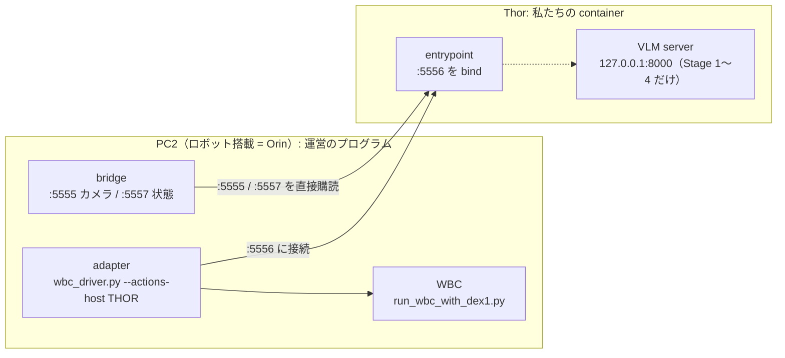
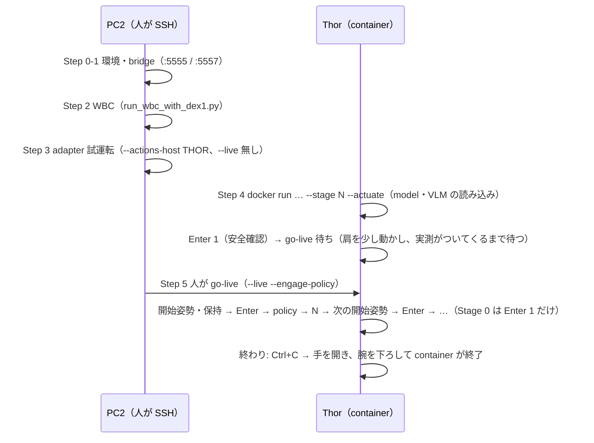

# 会場での動かし方 — Team RAMEN（Thor の image 1 つ）

会場では、運営の RUNBOOK（`iacevaltest/iros_g1_orin_package` の `docs/RUNBOOK.md`）どおり、
**全部を私たちが起動する**。PC2 では運営のプログラムだけを起動し、私たちの物は **Thor の container 1 つ**。
PC2 用の container は無い（運営 template の「PC2 の client」は使わない。理由は下の「全体の形」）。

## 0. 全体の形



- Thor の entrypoint が PC2 の `:5555` / `:5557` を**直接**読み、`:5556` は **Thor が bind** する。
  PC2 の adapter は `--actions-host <THOR_IP>` で Thor につなぐ（adapter の `--actions-host` は
  「:5556 を bind した側の host」、既定は 127.0.0.1 = PC2 自身）。
- VLM（hybrid pick の区間 1→2 の判定）は、Stage 1〜4 の run の中で container が自分で起動し、run の終わりに止める。
- container は run ごとに作り直す。重みは host の HF cache を読み取り専用で mount し、**実行中はネットに出ない**。

| Stage | 中身 | 操作（§2「操作キー」） |
|---|---|---|
| 0 | 準備（go-live 後に腕を下ろす → 台まで歩く → pick の開始姿勢） | Enter 1（安全確認）だけ |
| 1〜4 | 脚 1 本ずつ: 台を回す → pick（VLM + GR00T + IK + 持ち替え）→ insert → 締め付け | Enter 1 → policy ごとに開始姿勢で Enter → 終わったら **N** で次の policy へ |
| 5 | 台を裏返す（flip） | Enter 1 → 開始姿勢で Enter |

## 1. 事前準備（会場の前に Thor で 1 回）

```bash
# 置き場所（例）。以下の手順はこの 3 つを使う
export RAMEN_HOST_DIR=~/ramen
mkdir -p $RAMEN_HOST_DIR/{hf_cache,outputs,vlm_cache}

# image（tag 20260927-rebuild5 = 本体 e3a4187。digest は manifest.yaml の images.thor と同じ。
# GB10 での確認（VERIFY.md）はまだ。接続テストの前に通すこと）
docker pull ghcr.io/matsuolab-llmcompe2025-team-suzuki/ikea-thor@sha256:b58c2cd594955a092a7481a21f866577127c40f178748c64b9216d250a24939f

# 重みの事前取得（ネットのある所で。会場の実行中は取りに行かない）と、ネット無しの確認
#   → WEIGHTS.md（一覧・取り方・USB に入れる物・会場での確認）
```

- `vlm_cache` は VLM の compile 結果の置き場。1 回目の run だけ小さな kernel の compile が走り、2 回目以降は再利用する。
- `outputs` に run ごとの log（`orch_logs/orch_*.jsonl`、VLM の `orch_logs/vlm_*.log`）が残る。

## 2. 1 run の手順（**順番が大事**）



### Step 0〜1 [PC2] 環境とカメラ・状態の配信

RUNBOOK の Step 0（環境変数・`rt/lowcmd` を掴んでいる process が無いこと）と Step 1（`real_orin_cameras.py` と
`real_orin_state.py` の 2 本）をそのまま行う。

### Step 2 [PC2] WBC — **`run_wbc_with_dex1.py` で起動する**

```bash
conda activate g1_wbc
cd ~/GR00T-WholeBodyControl
python <運営 package の tools>/run_wbc_with_dex1.py \
  --interface real --no-with-hands --keyboard_dispatcher_type ros --no-enable-onscreen \
  --dex1-max-speed 4.2
```

- RUNBOOK の `run_g1_control_loop.py` **ではない**。それだとグリッパ（Dex1-1）を動かすものが居ない
  （`run_wbc_with_dex1.py` は同じ引数を受ける差し替えで、グリッパの指令を同じ `rt/lowcmd` に載せる）。
- `--dex1-max-speed 4.2`: 学習データのグリッパの速さ（運営の既定は 2.0）。
- `run_wbc_with_dex1.py` の PC2 上の置き場所は会場で確かめる（運営 package の `tools/` にある。運営 RUNBOOK
  （2026-09-25 版）の例は `~/wbc_adapter/deploy/run_wbc_with_dex1.py --interface eth0`。`--interface` は `real` でも
  インターフェース名でもよい）。
- **WBC の起動時の腕**: 運営 package が `f31952c`（2026-09-25）より古い wrapper だと、起動した瞬間に
  （adapter も私たちのコードもつながる前に）腕を肩 roll ±0.2・他 0 の姿勢へ 2 秒・フル剛性で動かす。新しい
  wrapper は実測の関節から始めて保持する（`--seed-from-measured` が既定。取れないと `[seed] WARNING: falling back
  to STOCK start-up` と出て古い動きになる）。どちらでも、**腕が台や物に届かない所で起動し**、止まってから stage の
  位置に置く。
- 安定した保持状態になってから次へ（`ros2 topic hz /G1Env/env_state_act`）。

### Step 3 [PC2] adapter の試運転（まだ `--live` を付けない）

```bash
conda activate g1_wbc
cd ~/wbc_adapter
python wbc_driver.py --lane decoupled --actions-host <THOR_IP> --state-source boundary
```

### Step 4 [Thor] 私たちの container

```bash
docker run -it --rm --runtime nvidia --gpus all -e NVIDIA_DISABLE_REQUIRE=1 --network host \
  -e IROS_ORIN_HOST=<PC2_IP> \
  -v $RAMEN_HOST_DIR/hf_cache:/root/.cache/huggingface:ro \
  -v $RAMEN_HOST_DIR/outputs:/app/ramen/outputs \
  -v $RAMEN_HOST_DIR/vlm_cache:/cache \
  ghcr.io/matsuolab-llmcompe2025-team-suzuki/ikea-thor@sha256:b58c2cd594955a092a7481a21f866577127c40f178748c64b9216d250a24939f \
  --stage N --actuate
```

- `-it` 必須（Enter・N・R を押すため。対話端末でないと `--actuate` は
  `N/R/Enter production controls require an interactive TTY` で起動しない）。`<PC2_IP>` は通常 `192.168.123.164`（会場で確認）。
- **操作する端末は半角英数にしておく**（日本語入力が ON だと N / R / Enter は何も表示されずに無視される）。
- 会場で変わらない option（boundary 経路・`:5556` の bind・VLM の起動・`--gpu-models all` など）は image の起動口
  （`docker/venue_entry.sh`）が付ける。**打つのは `--stage N --actuate` だけ。大会本番では option を足さない。**
  接続テストで試す option（model・送り方・手首 roll の clamp・Stage 0 の確かめ方）は `CONNECTION_TEST.md` にまとめてあり、
  決めた値は既定にしてから本番に使う。
- 起動すると model と（Stage 1〜4 では）VLM を読み込む。**読み込みは時間制限なしで待つ**（10 秒ごとに経過が出る）。
  目安（GB10 = Thor に近い arm64・128 GB 共有メモリで実測、2026-09-25）: Stage 1〜4 は Enter 1 まで 4〜5 分
  （VLM の起動 約 3.3 分 + model の読み込み）、Stage 5 は 1 分弱、Stage 0 は十数秒。GPU は VLM 込みで最大 42 GB。
- `Enter 1`: ハーネス・E-stop・周りの空きを確かめてから押す。
- 腕の送り方（既定、本体 #172）: joint lane で、目標が変わったときだけ最短 0.1 s おきに同じ目標を 16 行送る
  （`[boundary] publish: 16 row(s) per chunk, on change at most every 0.1s …`）。運営 WBC は腕を重力補償なしで
  動かすので、送る腕に重力の垂れの分を足す（`[boundary] gravity sag offset: on (kp=[100, 100, 40, 40, 20, 20, 20] …)`）。
  kp が会場の WBC と合っているかは接続テストで確かめる（`CONNECTION_TEST.md`）。
- 使う model は起動 log の `[init] policy variants: insert=… (config)` で分かる（`config` = 既定、`set:…` / `cli` = 切り替え）。
- go-live 待ち: 両肩を少し（−0.05 rad）動かす指令を出し、実測がついてくる（0.02 rad）まで待つ。時間制限なし。

### Step 5 [PC2] go-live — **人がキーボードで打つ**（script や agent から実行しない）

```bash
python wbc_driver.py --lane decoupled --actions-host <THOR_IP> --live --engage-policy
```

- **`--state-source boundary` を付けない**（既定の `wbc` のまま）。decoupled で `boundary` と `--live` を
  一緒にすると adapter が `LAUNCH DENIED` で起動を拒否する（RUNBOOK の Step 6 の書き方はこの点でコードと違う）。
- `--engage-policy` 必須（無いと WBC の下半身が学習済みの制御に入らないまま、他は全部正常に見える）。
- E-stop 担当が付いてから。

### その後（操作キー）

画面には `Stage`・`フェーズ`・今使える `操作` だけが出る。**policy の間の移り変わりは操作者のキーだけで進む**
（policy の完了や時間切れでは次へ進まない。本体 858e107）。移動中に押したキーは予約されずに捨てられる。

| キー | 動き |
|---|---|
| `Enter` | 開始姿勢に着いてから押すと policy が始まる。着いていない Enter は捨てられ、`[gate] initial pose not reached (worst=<関節> error=<rad>)` と一番ずれた関節が出る。insert・締め付けのやり直しでは、脚を置いた後の Enter で初期の握り幅へ、もう一度 Enter で開始 |
| `N` | 今の policy を止めて、次の policy の開始姿勢へ移る（着いたら Enter を待つ）。stage の最後の policy では効かない |
| `R` 1 回目 | 腕は最後の指令のまま、両手だけ全開にする |
| `R` 2 回目 | 開き終わってから効く。同じ policy の開始姿勢へ戻る（Enter まで始まらない） |
| `Ctrl+C` | 歩行を 0 にし、今の policy の開始姿勢 → 手を全開 → 起動時の道を逆にたどって腕を下ろし、終わる。**戻し動作の途中で 1 秒以上たってからもう一度押すと、その場で保持して終える**（運営 adapter の最後の指令保持を前提とする。実際の保持は WBC・電源・通信の状態に依存するため、E-stop 担当は離れない） |

- **押す前に腕が開始姿勢にあるかを目で確かめる。**
- Stage 0: go-live の直後に、WBC の既定の姿勢（前腕が前に出た HOME）から腕を下ろし
  （肩 roll ±0.2・肘 0.9）、台まで歩き、止まってから手を開いて pick の開始姿勢へ移る。Stage 0 の歩行中は N / R を受け付けない。
- **安全停止**（カメラ・関節の状態が途切れた、準備の動きが開始姿勢に届かなかった、想定外の例外）: 歩行だけ 0 にし、
  腕と Dex1 は最後の指令を保持して、`フェーズ：安全停止／保持中・判断待ち` で止まる（勝手に腕を動かさない）。
  持っている脚と周りを確かめてから、`Enter` = 戻し動作（上の Ctrl+C と同じ）、`Ctrl+C` = 動かさずにその場で終える。
  危ない動きは待たずに E-stop。

### なぜこの順番か

- PC2 の配信・WBC・adapter（試運転）を先に立て、Thor を最後に起動する（RUNBOOK と同じ）。
- Thor を go-live より先に起動するのは、指令を 1 通も受けていない adapter は WBC に何も送らず、
  WBC 自身の 1 秒の見張りが速度制限を通らない保持の目標を差し込むため。Thor が go-live 待ちで指令を
  出している状態で go-live する。

## 3. 次の run

- **Thor の `docker run` だけをやり直す**（`--stage` を変える）。
- **adapter は止めない。** `--engage-policy` は押すたびに切り替わる。adapter を起動し直すなら WBC から起動し直す。

## 4. よく出る表示

| 表示 | 意味・すること |
|---|---|
| `error: PC2 … -e IROS_ORIN_HOST=<PC2 の IP> で渡す` | `docker run` に `-e IROS_ORIN_HOST=…` を付け忘れた |
| `[vlm] loading... Ns (no time limit; …)` | VLM を読み込み中。待つ |
| `[vlm] server ready` → `[vlm] warm-up done` → `[hybrid] … preflight passed … vlm_latency=…` | VLM の準備完了。`vlm_latency` は本番と同じ 5 枚の問い合わせ 1 回の秒数（5 秒以内に答えないと、ロボットが動く前の確認で止まる） |
| `the VLM server exited while loading` | VLM が起動に失敗。末尾の log と `outputs/orch_logs/vlm_*.log` を見る |
| `…:8000 is already in use` | 前の VLM が残っている。`docker ps` で古い container を確かめる |
| `[groot] waiting for the GR00T worker to load... Ns` | GR00T の model を読み込み中。待つ |
| `[groot] integrated GPU: load headroom from MemAvailable=…` | 情報。GR00T を読む前の空きメモリ |
| `sender clock offset ~ ±x.xxxs` | 情報。PC2 と Thor の時計の差（指令の送信時刻をこの分だけ直している） |
| `[boundary] gravity sag offset: on (kp=… scale=1 …)` | 情報。運営 WBC の重力の垂れの分を腕に足している（joint lane の既定） |
| `Official boundary configuration rejected: gravity sag offset could not be built` | 重力の垂れ補正を作れない。起動を中止し、image・URDF・設定を確認する。`--boundary-gravity-offset off` は検証用であり、自動回避に使わない |
| `N/R/Enter production controls require an interactive TTY` | `docker run` に `-it` が無い |
| `フェーズ：安全停止／保持中・判断待ち` | 安全停止。直前の `[safety-stop] …` が理由。確かめてから Enter（戻す）か Ctrl+C（その場で終える） |
| `[gate] initial pose not reached (worst=… error=…); Enter ignored` | 開始姿勢に届いていないので Enter を捨てた。一番ずれた関節と量。腕を目で見て、届くのを待つ |
| 重みが cache に無い（`LocalEntryNotFoundError` など） | 事前取得の漏れ。`WEIGHTS.md` の 4（`prefetch_weights.py --check`） |

## 5. conformance（運営の適合試験）

```bash
# Thor（本番の run を動かしていないとき。:5555-5557 を 127.0.0.1 で使う）
docker run --rm --network host <IMAGE> pixi run --as-is -e runtime python /app/conformance.py --lane decoupled
# 手元（submit repo の直下）
python conformance.py --lane decoupled
```

`components/server.py` は conformance 専用（本番と同じ受け口・送り口で、実測の姿勢を保つ指令を送る）。
会場の run はこの file を通らない。`components/client.py` は conformance が起動するための置き物。

## 6. 09-27 の接続テスト

`CONNECTION_TEST.md`（運営に確かめること、起動の各段で見る所、試す run の順番、決め方、記録の表）。
