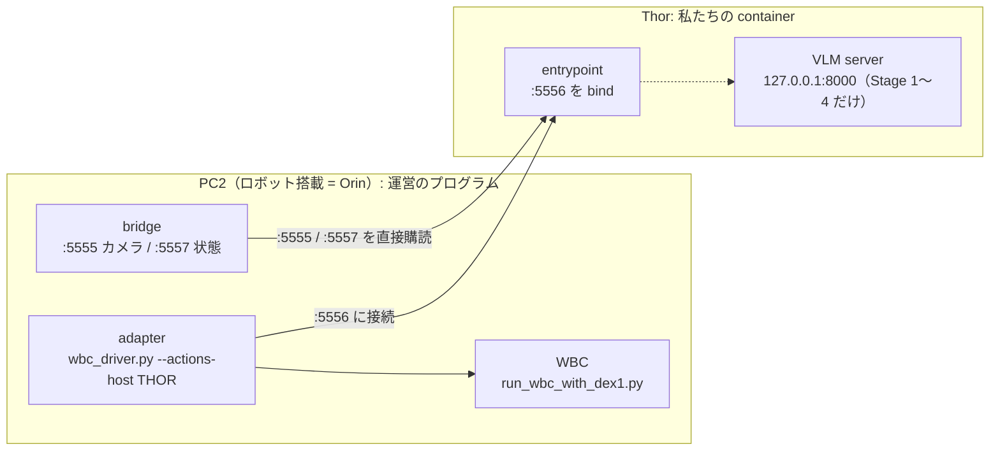
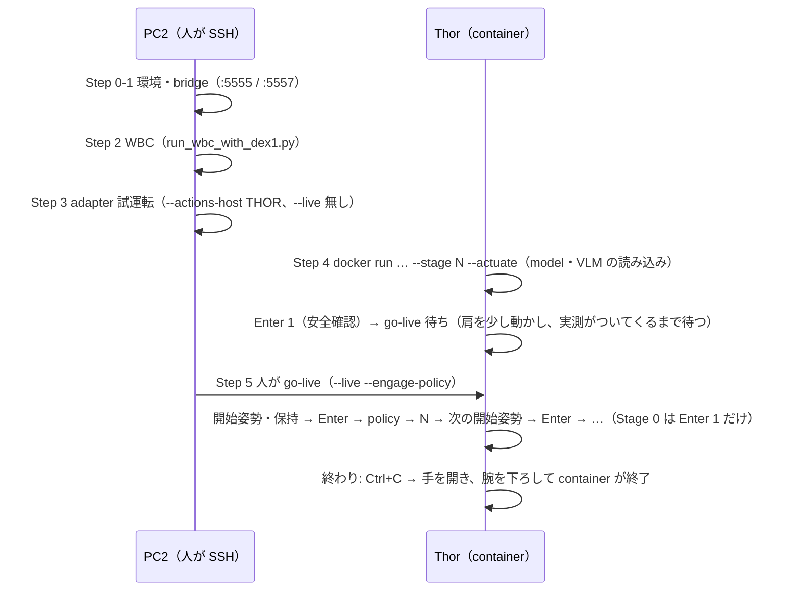

# 会場での動かし方 — Team RAMEN（Thor の image 1 つ）

会場では、運営の RUNBOOK（`iacevaltest/iros_g1_orin_package` の `docs/RUNBOOK.md`）どおり、
**全部を私たちが起動する**。PC2 では運営のプログラムだけを起動し、私たちの物は **Thor の container 1 つ**。
PC2 用の container は無い（運営 template の「PC2 の client」は使わない。理由は下の「全体の形」）。

## 0. 全体の形


```mermaid
flowchart LR
  subgraph PC2["PC2（ロボット搭載 = Orin）: 運営のプログラム"]
    BR["bridge<br/>:5555 カメラ / :5557 状態"]
    WBC["WBC<br/>run_wbc_with_dex1.py"]
    AD["adapter<br/>wbc_driver.py --actions-host THOR"]
  end
  subgraph THOR["Thor: 私たちの container"]
    EP["entrypoint<br/>:5556 を bind"]
    VLM["VLM server<br/>127.0.0.1:8000（Stage 1〜4 だけ）"]
  end
  BR -- ":5555 / :5557 を直接購読" --> EP
  AD -- ":5556 に接続" --> EP
  AD --> WBC
  EP -.-> VLM
```

- Thor の entrypoint が PC2 の `:5555` / `:5557` を**直接**読み、`:5556` は **Thor が bind** する。
  PC2 の adapter は `--actions-host <THOR_IP>` で Thor につなぐ（adapter の `--actions-host` は
  「:5556 を bind した側の host」、既定は 127.0.0.1 = PC2 自身）。
- VLM（hybrid pick の区間 1→2 の判定）は、Stage 1〜4 の run の中で container が自分で起動し、run の終わりに止める。
- container は run ごとに作り直す。重みは host の HF cache を読み取り専用で mount し、**実行中はネットに出ない**。

**この提出経路は運営WBCを使います。** joint laneは運営IKを迂回して腕関節角を渡す方式であり、
Regular Modeの`arm_sdk`へ直接送る方式ではありません。hybrid preflight等に残る`Regular`の文言は
実機モードを照会した結果ではないため、モード確認には使わないでください。
ロボット側のモード・WBCの起動状態は運営手順に従って確認します。

**通信断・強制終了は停止操作ではありません。** 運営adapter `497f3ab` は送信元が消えても
最後の歩行速度をkeepaliveで再送します（非作動試験で確認）。SSH切断、`kill`、`docker stop`で
ロボットが停止すると想定しないでください。通常停止は操作端末のCtrl+C、危険時・通信断時は現地の
E-stop担当者が対応します。運営側のclient-loss時の停止策を確認するまでは無人で歩行させないでください。

| Stage | 中身 | 操作（§2「操作キー」） |
|---|---|---|
| 0 | 準備（go-live 後に腕を下ろす → 決めた時間だけ前進 → pick の開始姿勢） | Enter 1（安全確認）だけ |
| 1 | 1本目: pick（VLM + GR00T + IK + 持ち替え）→ insert → 締め付け | Enter 1 → policy ごとに開始姿勢で Enter → 終わったら **N** で次の policy へ |
| 2〜4 | 脚1本ずつ: 台を回す → pick → insert → 締め付け | Enter 1 → policy ごとに開始姿勢で Enter → 終わったら **N** で次の policy へ |
| 5 | 台を裏返す（flip） | Enter 1 → 開始姿勢で Enter |

## 1. 事前準備（会場の前に Thor で 1 回）

```bash
# 置き場所。運営の指定はチームの folder（ADMINISTRATIVE_MANIFEST §6: In-Person/<TEAM>/ に Thor 側の image・file を置く）。
# 既に別の場所（例 ~/ramen）に重みを置いたなら、中身は動かさずにそこを指す。以下の手順はすべて $RAMEN_HOST_DIR を使う
export RAMEN_HOST_DIR=~/Humanoid_IKEA_Assembly_Challenge/In-Person/RAMEN
mkdir -p $RAMEN_HOST_DIR/{hf_cache,outputs,vlm_cache}

# image（tag gb10-guard-1cd5fdf = 本体 1cd5fdf。digest は manifest.yaml と同じ。
# GB10の確認記録はGB10_STATE_GUARD_REPORT.md。実機の追従・干渉は未検証）
docker pull ghcr.io/matsuolab-llmcompe2025-team-suzuki/ikea-thor@sha256:19ebe27030179aa04bc9d6f8c167971699fcc6417cbc3a5f23b2d2ae7a0f8262

# 重みの事前取得（ネットのある所で。会場の実行中は取りに行かない）と、ネット無しの確認
#   → WEIGHTS.md（一覧・取り方・USB に入れる物・会場での確認）

# 会場用の skill_config（毎 run の docker run で mount する。理由は 4 章の「会場用の skill_config」）。
# image の設定から Dex1 の到達の許容だけを 0.05 → 0.20 rad にした物（repo の venue/skill_config_venue.yaml と同じ）
docker run --rm ghcr.io/matsuolab-llmcompe2025-team-suzuki/ikea-thor@sha256:19ebe27030179aa04bc9d6f8c167971699fcc6417cbc3a5f23b2d2ae7a0f8262 \
  cat /app/ramen/inference/desktop/lower_policy/configs/skill_config.yaml \
  | sed 's/^  tolerance_rad: 0\.05 .*$/  tolerance_rad: 0.20  # venue: Dex1 air arrival, ~3.3 mm (INSTRUCTIONS.md sec. 4)/' \
  > $RAMEN_HOST_DIR/skill_config_venue.yaml
sha256sum $RAMEN_HOST_DIR/skill_config_venue.yaml
# → 70bea36ba92c47add9f8bcd605224d4df346c1de857c4c75f82f6dbeb38e780e と同じであること。違えば使わない
#   （手元の repo の venue/skill_config_venue.yaml を scp で $RAMEN_HOST_DIR に置いても同じ物になる）
```

- `vlm_cache` は VLM の compile 結果の置き場。1 回目の run だけ小さな kernel の compile が走り、2 回目以降は再利用する。
- `outputs` に run ごとの log（`orch_logs/orch_*.jsonl`、VLM の `orch_logs/vlm_*.log`）が残る。

## 2. 1 run の手順（**順番が大事**）


```mermaid
sequenceDiagram
  participant P as PC2（人が SSH）
  participant T as Thor（container）
  P->>P: Step 0-1 環境・bridge（:5555 / :5557）
  P->>P: Step 2 WBC（run_wbc_with_dex1.py）
  P->>P: Step 3 adapter 試運転（--actions-host THOR、--live 無し）
  T->>T: Step 4 docker run … --stage N --actuate（model・VLM の読み込み）
  T->>T: Enter 1（安全確認）→ go-live 待ち（肩を少し動かし、実測がついてくるまで待つ）
  P->>T: Step 5 人が go-live（--live --engage-policy）
  T->>T: 開始姿勢・保持 → Enter → policy → N → 次の開始姿勢 → Enter → …（Stage 0 は Enter 1 だけ）
  T->>T: 終わり: Ctrl+C → 手を開き、腕を下ろして container が終了
```

### 始める前に（毎 run。PC2 と Thor）

会場の PC2 は G1 (3)。以下は会場 PC2 の実ファイルと 2026-09-28/29 の実機 log で確かめた手順
（運営 RUNBOOK の `conda activate …` の書き方はこの機体では使えない）。

- **tmux の中で動かす。** SSH が切れても端末ごと残り、つなぎ直して `tmux attach` で操作を続けられる
  （2026-09-29 の他チームの実機セッションで SSH が切れ、WBC と adapter が動いたまま残った）。
  PC2: `tmux new -s ramen`（カメラ・状態・WBC・adapter を別 window で）、Thor: `tmux new -s ramen`（`docker run -it` を中で）。
  tmux の外で `docker run -it` した後に切れたら、つなぎ直して `docker ps` → `docker attach <container>` で同じ端末に戻る
  （抜けるのは Ctrl+P Ctrl+Q。attach 中の Ctrl+C は run を止める）。
- **PC2 に他チームの WBC・adapter・bridge が残っていないか**（WBC が 2 つあると同じ `rt/lowcmd` を 2 つが出す）:
  ```bash
  ps -eo pid,user,etime,args | grep -E "run_wbc_with_dex1|run_g1_control_loop|wbc_driver|real_orin|g1_policy_bridge|gear_sonic" | grep -v grep
  ```
  残っていたら**自分で kill せず、運営に止めてもらう。**
- **Thor に前の container や port が残っていないか**: `docker ps`、`ss -ltnp | grep -E ':(5556|8000)\b'`、`nvidia-smi`。
  `:5556` を他が掴んでいると私たちの bind が失敗し、`:8000` なら VLM が起動できない。
- **Thor に提出 image があるか**（無いと run が始まらない。会場の回線では GitHub からの pull が途中で切れた実例がある、2026-09-27）:
  ```bash
  docker image inspect ghcr.io/matsuolab-llmcompe2025-team-suzuki/ikea-thor@sha256:19ebe27030179aa04bc9d6f8c167971699fcc6417cbc3a5f23b2d2ae7a0f8262 --format '{{.Id}}'
  ```
  エラーなら run の前に pull（約 9 GB）か USB から `docker load`。
- **Thor の shell で `$RAMEN_HOST_DIR` が重みを置いた場所を指しているか**（新しい shell・tmux window では空になる。
  空のまま `docker run` すると `/hf_cache` などの空の directory が mount され、重みが無くて止まる）:
  `echo $RAMEN_HOST_DIR && ls $RAMEN_HOST_DIR/hf_cache/hub | head -3`。空なら 1 章の `export` をもう一度。
- **Thor に会場用の skill_config があるか**（1 章で作った物。無いと Step 4 で docker が同じ名前の空の directory を作り、
  起動が `IsADirectoryError` で止まる）。image の設定との違いが、許容の 1 行（と 4 章の手順で直した行）だけであること:
  ```bash
  docker run --rm ghcr.io/matsuolab-llmcompe2025-team-suzuki/ikea-thor@sha256:19ebe27030179aa04bc9d6f8c167971699fcc6417cbc3a5f23b2d2ae7a0f8262 \
    cat /app/ramen/inference/desktop/lower_policy/configs/skill_config.yaml | diff - $RAMEN_HOST_DIR/skill_config_venue.yaml
  ```
- **Stage 0 の歩く距離を運営に確かめる。** Stage 0 は目で見て止まらず、決めた時間だけ前進する
  （`skills.move_to_table` の `vx` 0.185 m/s × `max_dwell_sec` 1.0 s ≈ 0.19 m。加減速で実際はこれより短い）。
  スタート位置が台からそれより遠いなら、4 章の手順で `max_dwell_sec` だけを変える（`vx` は変えない）。
- IP: Thor のロボット側は `192.168.123.222`（`ip -4 addr show`）、PC2 は `192.168.123.164`。以下の `<THOR_IP>` / `<PC2_IP>` はこの値。

### Step 0〜1 [PC2] カメラ・状態の配信

PC2 の新しい shell は `ros:foxy(1) noetic(2) ?` と聞く。**何も選ばず Enter**（1 / 2 を選ぶと下の env が読み込みを拒否する）。
この機体に base conda は無い（`conda activate` は使わない。env は下の `source` で読む）。

```bash
# カメラ（tmux window 1）
source ~/iros_g1_3/iros_env_teleimager.sh
python ~/real_orin_cameras.py

# 状態（tmux window 2）
source ~/iros_g1_3/iros_env.sh
python ~/real_orin_state.py
```

- カメラで確かめる行: `head camera live at 1280x480 (native side-by-side; …)`、
  `left_wrist (RealSense 262622270004) live`、`right_wrist (RealSense 262622273652) live`。
  wrist の左右は運営が画像で確かめた割り当てで、`iros_env_teleimager.sh` が設定する（読まずに起動すると頭カメラの
  名前が合わず、wrist の左右も決まらない）。
- 状態で確かめる行: `Dex1 left (motor 31): raw closed -0.720 / open +4.640 -> published 0.00 closed / -5.30 open` と
  `Dex1 right (motor 33): raw closed +0.000 / open +5.380 -> …`。**この 2 行が無ければ止める**（校正を読まない
  `~/iros_g1_orin_package/reference/orin_bridge/real_orin_state.py` を起動している。グリッパの実測が逆向きになる）。

### Step 2 [PC2] WBC — **`run_wbc_with_dex1.py` で起動する**

```bash
# tmux window 3
source ~/iros_g1_3/iros_env.sh
cd ~/GR00T-WholeBodyControl
iros_with_wbc_preload python ~/wbc_adapter/deploy/run_wbc_with_dex1.py \
  --interface eth0 --no-with-hands --keyboard_dispatcher_type ros --no-enable-onscreen \
  --dex1-max-speed 4.2
```

- **`~/wbc_adapter/deploy/run_wbc_with_dex1.py` を使う。** `~/iros_g1_orin_package/tools/run_wbc_with_dex1.py`（運営 package
  `497f3ab` のまま）はベンチ機のグリッパの向き（0 = 閉 / −5.30 = 開）を決め打ちしている。この機体は開く向きが逆
  （左 −0.72 閉 / +4.64 開、右 0.00 閉 / +5.38 開。`iros_env.sh` が `IROS_DEX1_*` で渡す）なので、package の方で起動すると
  「開け」でグリッパを閉じる側の端へ押し付ける。
- 起動 log で確かめる行: `[dex1] left (motor 31): closed q=-0.720, open q=+4.640` と
  `[dex1] right (motor 33): closed q=+0.000, open q=+5.380`（**出なければ止める**）、
  `[seed] upper-body interpolator seeded from MEASURED q`、`[wbc] defaulting --upper-body-joint-speed 3.0`。
- `iros_with_wbc_preload` は WBC の process にだけ torch の `LD_PRELOAD` を付ける（adapter や bridge には付けない）。
- RUNBOOK の `run_g1_control_loop.py` **ではない**。それだとグリッパ（Dex1-1）を動かすものが居ない
  （`run_wbc_with_dex1.py` は同じ引数を受ける差し替えで、グリッパの指令を同じ `rt/lowcmd` に載せる）。
- `--dex1-max-speed 4.2`: 学習データのグリッパの速さ（運営の既定は 2.0）。
- **WBC の起動時の腕**: 運営 package が `f31952c`（2026-09-25）より古い wrapper だと、起動した瞬間に
  （adapter も私たちのコードもつながる前に）腕を肩 roll ±0.2・他 0 の姿勢へ 2 秒・フル剛性で動かす。新しい
  wrapper は実測の関節から始めて保持する（`--seed-from-measured` が既定。取れないと `[seed] WARNING: falling back
  to STOCK start-up` と出て古い動きになる）。どちらでも、**腕が台や物に届かない所で起動し**、止まってから stage の
  位置に置く。
- 安定した保持状態になってから次へ（`iros_env.sh` を読んだ別の shell で `ros2 topic hz /G1Env/env_state_act`）。

### Step 3 [PC2] adapter の試運転（まだ `--live` を付けない）

```bash
# tmux window 4
source ~/iros_g1_3/iros_env.sh
cd ~/wbc_adapter
python wbc_driver.py --lane decoupled --actions-host 192.168.123.222 --state-source boundary
```

- `[adapter] no actions on :5556 yet` が出ていれば、Thor の起動を待っている状態。
- 試運転は Ctrl+C で止めてから Step 4 へ（go-live の adapter は Step 5 で同じ window に起動する）。

### Step 4 [Thor] 私たちの container

```bash
docker run -it --rm --runtime nvidia --gpus all -e NVIDIA_DISABLE_REQUIRE=1 --network host \
  -e IROS_ORIN_HOST=192.168.123.164 \
  -v $RAMEN_HOST_DIR/hf_cache:/root/.cache/huggingface:ro \
  -v $RAMEN_HOST_DIR/outputs:/app/ramen/outputs \
  -v $RAMEN_HOST_DIR/vlm_cache:/cache \
  -v $RAMEN_HOST_DIR/skill_config_venue.yaml:/app/venue_skill_config.yaml:ro \
  ghcr.io/matsuolab-llmcompe2025-team-suzuki/ikea-thor@sha256:19ebe27030179aa04bc9d6f8c167971699fcc6417cbc3a5f23b2d2ae7a0f8262 \
  --stage N --actuate --skill-config /app/venue_skill_config.yaml
```

- `-it` 必須（Enter・N・R を押すため。対話端末でないと `--actuate` は
  `N/R/Enter production controls require an interactive TTY` で起動しない）。`<PC2_IP>` は通常 `192.168.123.164`（会場で確認）。
- **操作する端末は半角英数にしておく**（日本語入力が ON だと N / R / Enter は何も表示されずに無視される）。
- 会場で変わらない option（boundary 経路・`:5556` の bind・VLM の起動・`--gpu-models plan` など）は image の起動口
  （`docker/venue_entry.sh`）が付ける。**打つのは `--stage N --actuate --skill-config /app/venue_skill_config.yaml` だけ
  （会場用の skill_config。この image を使う間は毎回付ける）。大会本番ではほかの option を足さない。**
  起動 log の `[init] topic=… skill_config=/app/venue_skill_config.yaml` で会場用の設定を読んだと分かる。
  model・送り方などを切り替える option の説明は `CONNECTION_TEST.md` の付録（09-27 の接続テスト用。本番では使わない）。
- 起動すると model と（Stage 1〜4 では）VLM を読み込む。**読み込みは時間制限なしで待つ**（10 秒ごとに経過が出る）。
  目安（GB10 = Thor に近い arm64・128 GB 共有メモリで実測、2026-09-25）: Stage 1〜4 は Enter 1 まで 4〜5 分
  （VLM の起動 約 3.3 分 + model の読み込み）、Stage 5 は 1 分弱、Stage 0 は十数秒。
  旧image `10b8d73` の全Stage連続試験ではGPU使用量の最大44.36 GiB、MemAvailableの最小39.78 GiBを記録した。
  新imageの検証結果は`GB10_STATE_GUARD_REPORT.md`を参照する。
  GB10の測定値をThorの起動時間やメモリ上限の保証として扱わない。
- `Enter 1`: ハーネス・E-stop・周りの空きを確かめてから押す。
- 通常Policyの腕の送り方（本体 #172）: joint lane で、目標が変わったときだけ最短 0.1 s おきに同じ目標を 16 行送る
  （`[boundary] publish: 16 row(s) per chunk, on change at most every 0.1s …`）。運営 WBC は腕を重力補償なしで
  動かすので、送る腕に重力の垂れの分を足す（`[boundary] gravity sag offset: on (kp=[100, 100, 40, 40, 20, 20, 20] …)`）。
  kp が会場の WBC と合っているかは接続テストで確かめる（`CONNECTION_TEST.md`）。
- 準備・戻し動作（本体 #181）は別方式: 公式 `JointSink.send_goto` を各区間に一度だけ送り、
  最大0.3 rad/sで進む。15秒上限を超える区間は同じ線分上で分割する。
  goto中に通常chunkで上書きしない。SDKの加速度制限付き補間と同じではない。
- 使う model は起動 log の `[init] policy variants: insert=… (config)` で分かる（`config` = 既定、`set:…` / `cli` = 切り替え）。
- go-live 待ち: 両肩を少し（−0.05 rad）動かす指令を出し、実測がついてくる（0.02 rad）まで待つ。時間制限なし。

### Step 5 [PC2] go-live — **人がキーボードで打つ**（script や agent から実行しない）

```bash
# tmux window 4（Step 3 と同じ env）
source ~/iros_g1_3/iros_env.sh
cd ~/wbc_adapter
python wbc_driver.py --lane decoupled --actions-host 192.168.123.222 --live --engage-policy
```

- `Press Enter to proceed, Ctrl+C to abort...` と聞くので、E-stop 担当を確かめてから Enter。**対話端末で起動する**
  （tmux の window。標準入力の無い起動では `EOFError` で落ちた実例がある、2026-09-28）。
- 確かめる行: `joint lane: ON -- topics b'joint'/b'goto', limits=urdf, goto max speed 0.45 rad/s …`
  （joint lane が使える。私たちの既定の送り方）と `--engage-policy: sent toggle_policy_action=True once`。

- **`--state-source boundary` を付けない**（既定の `wbc` のまま）。decoupled で `boundary` と `--live` を
  一緒にすると adapter が `LAUNCH DENIED` で起動を拒否する（RUNBOOK の Step 6 の書き方はこの点でコードと違う）。
- `--engage-policy` 必須（無いと WBC の下半身が学習済みの制御に入らないまま、他は全部正常に見える）。
- E-stop 担当が付いてから。

### その後（操作キー）

画面には `Stage`・`フェーズ`・今使える `操作` だけが出る。**policy の間の移り変わりは操作者のキーだけで進む**
（policy の完了や時間切れでは次へ進まない。本体 858e107）。移動中に押したキーは予約されずに捨てられる。

| キー | 動き |
|---|---|
| `Enter` | 開始姿勢に着いてから押すと policy が始まる。着いていない Enter は捨てられ、`[gate] initial pose not reached (worst=<関節> error=<rad>)` と一番ずれた関節が出る。insert・締め付けのやり直しでは、脚を置いた後の Enter で初期の握り幅へ、もう一度 Enter で開始 |
| `N` | 今の policy を止めて、次の policy の開始姿勢へ移る（着いたら Enter を待つ）。stage の最後の policy では効かない |
| `R` 1 回目（Policy中） | 腕は最後の指令のまま、両手だけ全開にする |
| `R` 2 回目 | 開き終わってから効く。同じ policy の開始姿勢へ戻る（Enter まで始まらない） |
| `Ctrl+C` | 歩行を 0 にし、今の policy の開始姿勢 → 手を全開 → 起動時の道を逆にたどって腕を下ろし、終わる。**戻し動作の途中で 1 秒以上たってからもう一度押すと、その場で保持して終える**（運営 adapter の最後の指令保持を前提とする。実際の保持は WBC・電源・通信の状態に依存するため、E-stop 担当は離れない） |

- **押す前に腕が開始姿勢にあるかを目で確かめる。**
- Stage 0: go-live の直後に、現在の実測姿勢から腕を下ろし
  （肩 roll ±0.2・肘 0.9）、決めた時間だけ前進し（目で見て止まらない。距離は「始める前に」）、
  止まってから手を開いて pick の開始姿勢へ移る。Stage 0 の歩行中は N / R を受け付けない。
  台に近づきすぎたら待たずに E-stop（歩行中に通信が切れても運営 adapter は歩き続ける）。
- **準備保持**（`準備／<経由点>／holding`）: 予定時間+5秒で未到達なら、その経由点で保持する。
  誤差と関節indexを確認し、Rで**同じ経由点だけ**再試行できる。遅れて到達すると`ready`になり、
  新しいEnterで準備を続ける。このEnterはPolicy開始のEnterとは別。モデルを読み直す必要はない。
  未到達のEnter/Nで先へ飛ばすことはできない。戻し動作中も同じ方式。
- **安全停止**（カメラ・関節の状態が途切れた、想定外の例外）: 歩行だけ 0 にし、
  腕と Dex1 は最後の指令を保持して、`フェーズ：安全停止／保持中・判断待ち` で止まる（勝手に腕を動かさない）。
  持っている脚と周りを確かめてから、`Enter` = 戻し動作（上の Ctrl+C と同じ）、`Ctrl+C` = 動かさずにその場で終える。
  危ない動きは待たずに E-stop。

### なぜこの順番か

- PC2 の配信・WBC・adapter（試運転）を先に立て、Thor を最後に起動する（RUNBOOK と同じ）。
- Thor を go-live より先に起動するのは、指令を 1 通も受けていない adapter は WBC に何も送らず、
  WBC 自身の 1 秒の見張りが速度制限を通らない保持の目標を差し込むため。Thor が go-live 待ちで指令を
  出している状態で go-live する。

## 3. 次の run

- **Thor の `docker run` だけをやり直す**（`--stage` を変える）。PC2 のカメラ・状態・WBC は止めない。
- **adapter は止めない。** `--engage-policy` は押すたびに切り替わる。adapter を起動し直すなら WBC から起動し直す。

## 4. よく出る表示

| 表示 | 意味・すること |
|---|---|
| `error: PC2 … -e IROS_ORIN_HOST=<PC2 の IP> で渡す` | `docker run` に `-e IROS_ORIN_HOST=…` を付け忘れた |
| `[vlm] loading... Ns (no time limit; …)` | VLM を読み込み中。待つ |
| `[vlm] server ready` → `[vlm] warm-up done` → `[hybrid] … preflight passed … vlm_latency=…` | VLM の準備完了。`vlm_latency` は本番と同じ 5 枚の問い合わせ 1 回の秒数（5 秒以内に答えないと、ロボットが動く前の確認で止まる） |
| `the VLM server exited while loading` | VLM が起動に失敗。末尾の log と `outputs/orch_logs/vlm_*.log` を見る |
| `…:8000 is already in use` | 前の VLM が残っている。`docker ps` で古い container を確かめる |
| `[groot] waiting for the GR00T worker to load... Ns` | GR00T の model を読み込み中。待つ |
| `[groot] integrated GPU: load headroom from MemAvailable=…` | 情報。GR00T を読む前の空きメモリ |
| `[preparation] … error=…rad joint=… speed=…rad/s` | 準備の予定時間・実測誤差・速度。`holding`なら同じ経由点をRで再試行、`ready`ならEnterで準備を続行 |
| `sender clock offset ~ ±x.xxxs` | 情報。PC2 と Thor の時計の差（指令の送信時刻をこの分だけ直している） |
| `[boundary] gravity sag offset: on (kp=… scale=1 …)` | 情報。運営 WBC の重力の垂れの分を腕に足している（joint lane の既定） |
| `Official boundary configuration rejected: gravity sag offset could not be built` | 重力の垂れ補正を作れない。起動を中止し、image・URDF・設定を確認する。`--boundary-gravity-offset off` は検証用であり、自動回避に使わない |
| `N/R/Enter production controls require an interactive TTY` | `docker run` に `-it` が無い |
| `フェーズ：安全停止／保持中・判断待ち` | 安全停止。直前の `[safety-stop] …` が理由。確かめてから Enter（戻す）か Ctrl+C（その場で終える） |
| `[gate] initial pose not reached (worst=… error=…); Enter ignored` | 開始姿勢に届いていないので Enter を捨てた。一番ずれた関節と量。腕を目で見て、届くのを待つ |
| 重みが cache に無い（`LocalEntryNotFoundError` など） | 事前取得の漏れ。`WEIGHTS.md` の 4（`prefetch_weights.py --check`） |
| `Address already in use`（`:5556`） | 前の run か他チームの container が `:5556` を掴んでいる。`docker ps` / `ss -ltnp` で確かめ、自分の古い container なら止める。他チームなら運営へ |
| `skill config not found` / `IsADirectoryError: … venue_skill_config.yaml` | 会場用の skill_config が Thor に無い（docker が同じ名前の空の directory を作った）。`rmdir $RAMEN_HOST_DIR/skill_config_venue.yaml` の後、1 章の手順で作り直す |
| `operator transition 'hand_…' did not reach its target: hand_… did not reach [a, b] before the deadline (measured=[…])` | Dex1 が目標（全開 5.3、または開始時の開き幅）まで許容の 0.20 rad 以内に届かずに安全停止した。まず Step 1 の状態 bridge の Dex1 校正の 2 行を確かめる（無ければ bridge を起動し直す）。校正が正しく、`measured` と目標の差が 0.3 rad 未満なら、下の手順で許容を 0.30 にして次の run を始める。それ以上ずれるなら Dex1 の故障・干渉を疑い、運営に確かめる |
| `[gate] … NOT reached` や `[preparation] … holding` が続き、`joint=` が同じ関節 | その関節が届いていない。腕を目で見て、干渉が無ければ R で同じ経由点を再試行（準備）か、届くまで待つ（開始待ち） |

#### 会場用の skill_config

image の skill_config と違うのは、Dex1 の到達の許容 `hand_pre_motion.tolerance_rad` だけ（0.05 → 0.20 rad。
指先で約 3.3 mm）。会場の Dex1 は運営の中継（`~/wbc_adapter/deploy/run_wbc_with_dex1.py`）の柔らかい P 制御
（kp 5.0、重力・摩擦の補償なし）で動き、全開は手で動かして測った機械の端。目標の手前で止まると、0.05 rad では
時間切れになり、Dex1 の時間切れは腕の準備と違って保持の道が無く、その run が policy の前に終わる
（本体の同じ code で、手前 0.08 / 0.12 rad で止まる Dex1 は 0.05 では時間切れ、0.20 では完了: `tests/test_venue_skill_config.py`）。
完了は「許容の中に 5 回続けて入る」ことなので、大きく動いている途中では完了しない。
全開の目標（5.3 rad）・開始時の開き幅・policy の手の指令は変えない。

会場で直すとき（上の表の行のとき・Stage 0 の距離）。直した後は「始める前に」の `diff` で、直した行だけが違うことを確かめる:

```bash
# Dex1 の到達の許容を 0.30 rad へ
sed -i 's/^  tolerance_rad: 0\.20 /  tolerance_rad: 0.30 /' $RAMEN_HOST_DIR/skill_config_venue.yaml
# Stage 0 の前進時間（距離 ≈ 0.185 m/s × 秒。例: 約 0.6 m なら 3.2）。vx は変えない
sed -i 's/^    max_dwell_sec: 1\.0$/    max_dwell_sec: 3.2/' $RAMEN_HOST_DIR/skill_config_venue.yaml
```

**pose lane（`--boundary-lane pose`）に切り替えない。** 2026-09-29 の他チームの実機 run では、この機体の運営 IK の受理が
602 waypoint で左右とも 0% だった（joint lane は reject 0）。

## 5. conformance（運営の適合試験）

```bash
# Thor（本番の run を動かしていないとき。:5555-5557 を 127.0.0.1 で使う）
docker run --rm --network host <IMAGE> pixi run --as-is -e runtime python /app/conformance.py --lane decoupled
# 手元（submit repo の直下）
python conformance.py --lane decoupled
```

`components/server.py` は conformance 専用（本番と同じ受け口・送り口で、実測の姿勢を保つ指令を送る）。
会場の run はこの file を通らない。`components/client.py` は conformance が起動するための置き物。

## 6. 接続テスト（09-27）の記録

`CONNECTION_TEST.md`（09-27 の接続テストの計画と、その後に会場で分かったこと。本番の手順はこの文書）。

## 7. 任意: PC2 の読み取り専用 state guard（既定では無効）

運営 bridge（`~/real_orin_state.py`）は最後に受けた `rt/lowstate` を 50 Hz で配り直し、DDS の時刻・tick を載せない。
ロボットが止まっているのか、DDS が止まって bridge が古い値を配り直しているのかを、Thor 側では区別できない。
guard はこれを補う**任意の**経路（本体 [#184](https://github.com/matsuolab-llmcompe2025-team-suzuki/iros_2026_ramen/issues/184)）。
**既定の経路（Thor が `:5557` を直接読む）は変えない。**

使える条件（全部そろうまで使わない）:

- guard 対応の `gb10-guard-1cd5fdf` 以降を使用する（`VERIFY.md` §9、検証結果は `GB10_STATE_GUARD_REPORT.md`）。
  旧 image `gb10-preparation-10b8d73` には無く、option を付けると引数の誤りで起動しない。
- PC2 に私たちのプロセスを 1 つ足し、`:5558` を開けることを運営の PC2 担当が許可したとき。

PC2 に置く物（手元の submit repo の直下で作り、`scp` で PC2 の `~/ramen-state-guard/` に展開する。運営の file は上書きしない）:

```bash
python3 tools/package_pc2_guard.py /tmp/ramen-pc2-guard.tar.gz   # guard・G1 (3) の profile・SHA256SUMS・RAMEN_SOURCE.txt
```

PC2 の新しい tmux window で（Step 0〜1 の状態 bridge を起動した後）:

```bash
source ~/iros_g1_3/iros_env.sh
cd ~/ramen-state-guard
sha256sum -c SHA256SUMS
grep '^commit:' RAMEN_SOURCE.txt       # Thor の image の本体 commit と同じであること
python venue_state_guard.py --check-only   # 運営の 6 file の hash と環境変数だけを確かめる（DDS・socket は開かない）
python venue_state_guard.py --bind-address <PC2_IP>
```

- `--bind-address` は PC2 のロボット側の IP（`192.168.123.164`）。既定の `127.0.0.1` のままでは Thor から読めない。
- 確かめる行: `[state-guard] profile=G1(3) internal, …; organizer files/environment verified` と
  `[state-guard] read-only: DDS subscriber + state relay; NO actuator/publisher`。
- Thor では Step 4 の `docker run` の最後に `--boundary-state-guard --boundary-state-port 5558` を足す。
- guard は DDS の tick が進んでいる間だけ state を返す（止まっている姿勢でも tick が進めば正常）。bridge の値は、guard 自身が
  0.25 s 以内に受けた DDS の値と照合する（ぴったり一致、無ければ全値 0.01 以内）。guard が返さない間、Thor は古い state で
  到達判定を進めず、state が古くなると鮮度の検査で安全停止する。手の実測が無いときも指令のエコーには戻らない。
- `[state-guard] …` が続いて run が始まらないとき: 表示された理由を確かめる（`waiting for advancing DDS ticks` = DDS が来ない、
  `upstream :5557 missing or stale` = 状態 bridge が止まった、`DDS tick regressed` = ロボットの再起動。guard の再起動が要る）。
  guard を使えないときは、**Thor の run を option 無しで起動し直せば既定の `:5557` の経路に戻る**（run の途中で切り替えない）。
- guard を起動し直したら、Thor の run も起動し直す（`state guard restarted` で止まる。自動で再開しない）。
