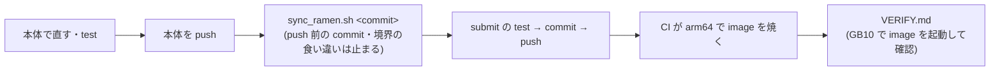

# Team RAMEN — IKEA IROS 提出物

## Team RAMEN の部分と直す場所

**推論のコードの正本は本体（`iros_2026_ramen`）。** この repo の `ramen/` は本体の 1 commit の写しで、
`tools/sync_ramen.sh` だけが書き換える。**`ramen/` は手で直さない**（次のコピーで黙って消え、本体のどの
commit と同じなのかも分からなくなる）。

| 直したいもの | 直す場所 |
|---|---|
| 推論の中身（skill・model の読み込み・VLM・設定の YAML・`policy_config.yaml` の model の選択） | **本体**を直して push → この repo で `./tools/sync_ramen.sh <commit>` → commit |
| image の中身（apt・環境・container 全体の環境変数 `HF_HUB_OFFLINE` / `YOLO_OFFLINE` など） | `docker/Dockerfile.thor` |
| 会場で毎回同じ起動の option（boundary 経路・`--spawn-vlm-server`・`--gpu-models all` など） | `docker/venue_entry.sh`（image の起動口） |
| 会場の手順・運営に出す宣言・重みの一覧 | `INSTRUCTIONS.md`・`manifest.yaml`・`WEIGHTS.md`（重みの一覧は `tools/prefetch_weights.py` が正本） |
| conformance の受け口 | `components/` |

更新の流れ:

- コピー元の commit は `ramen/RAMEN_SOURCE.txt` に残る。コピーしたら差分を読んでから commit する。
- image を焼き直したら、会場の前に `VERIFY.md` の手順（Vast.ai の GB10 で image を起動し、ネット無しで全 stage が
  立ち上がるか・外に接続しないか）で確かめる。

## 運営の責任範囲

運営が用意するもの。**ここに書いたもの以外は、すべて Team RAMEN のもの。**

### 会場（ロボットに載っている PC2 の上）

| もの | やること |
|---|---|
| カメラ bridge | `:5555` に head と手首カメラの JPEG を publish する |
| 状態 bridge | `:5557` に `body_q`・`base_quat` を 50 Hz で publish する（2026-09-21 以降の bridge は `gripper_q` も載せる。CONTRACT には無い項目） |
| WBC adapter | 我々が bind した `:5556` に接続し、`(T,25)` を IK で関節の目標にして WBC に渡す。手の列は Dex1 へ relay する |
| WBC 本体 | 全身の制御 |
| e-stop | 我々のコードを通らずにモータを止める |

これらを誰が起動するかは、運営の README（"You do not run any of this"）と
RUNBOOK（"you run the whole pipeline yourself"）で食い違っている。

### この repo の中（運営の template から取り込む。手で変更しない）

`tools/update_organizer.sh` で運営の template から上書きする。取り込んだ commit は
`ORGANIZER_SOURCE.txt` に残る。

| path | 役割 |
|---|---|
| `boundary/` | 3 socket（`:5555` / `:5557` / `:5556`）の契約の実装 |
| `mocks/` | ロボット無しで試すための偽 PC2（`mock_orin.py`）と偽 WBC（`mock_wbc.py`） |
| `conformance.py` | 提出前の配線確認（提出の条件）。`components/server.py` と `components/client.py` をこの名前で起動する |
| `requirements.txt` | template の依存 |

### 正本

- template: https://github.com/iacevaltest/ikea_iros_submit （取り込んだ commit は `ORGANIZER_SOURCE.txt`）
- interface package: https://github.com/iacevaltest/iros_g1_orin_package @ `47f4e1b`
  （`docs/CONTRACT.md`。doc とコードが食い違ったらコードが正）
