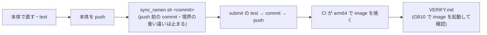

# Team RAMEN — IKEA IROS 提出物

提出情報は [SUBMISSION.md](SUBMISSION.md) に集約しています。提出 image は `gb10-preparation-10b8d73`（本体 `10b8d73`）で、
[manifest.yaml](manifest.yaml) の digest 固定版を使います。会場では image に加えて、image の設定から Dex1 の到達の許容だけを
広げた会場用の skill_config（[venue/skill_config_venue.yaml](venue/skill_config_venue.yaml)）を mount します。
重みの取得は [WEIGHTS.md](WEIGHTS.md)、会場での起動は [INSTRUCTIONS.md](INSTRUCTIONS.md)、image の検証結果は
[GB10_PREPARATION_REPORT.md](GB10_PREPARATION_REPORT.md) を参照してください。

## Team RAMEN の部分と直す場所

**推論のコードの正本は本体（`iros_2026_ramen`）。** この repo の `ramen/` は本体の 1 commit の写しで、
`tools/sync_ramen.sh` だけが書き換える。**`ramen/` は手で直さない**（次のコピーで黙って消え、本体のどの
commit と同じなのかも分からなくなる）。

| 直したいもの | 直す場所 |
|---|---|
| 推論の中身（skill・model の読み込み・VLM・設定の YAML・`policy_config.yaml` の model の選択） | **本体**を直して push → この repo で `./tools/sync_ramen.sh <commit>` → commit |
| image の中身（apt・環境・container 全体の環境変数 `HF_HUB_OFFLINE` / `YOLO_OFFLINE` など） | `docker/Dockerfile.thor` |
| 会場で毎回同じ起動の option（boundary 経路・`--spawn-vlm-server`・`--gpu-models all` など） | `docker/venue_entry.sh`（image の起動口） |
| 会場の手順・運営に出す宣言・重みの一覧 | `INSTRUCTIONS.md`・`manifest.yaml`・`WEIGHTS.md`（重みの一覧は `tools/prefetch_weights.py` が正本） |
| 焼き直さずに会場で変える値（Dex1 の到達の許容・Stage 0 の前進時間） | `venue/skill_config_venue.yaml`（image の skill_config から作る。`tests/test_venue_skill_config.py` が差を固定。焼き直したら作り直す） |
| 接続テスト（09-27）の記録と、切り替えの option の説明 | `CONNECTION_TEST.md`（履歴。本番は `INSTRUCTIONS.md` の起動だけで、option は足さない） |
| conformance の受け口 | `components/` |

更新の流れ:

```mermaid
flowchart LR
  A[本体で直す・test] --> B[本体を push]
  B --> C["sync_ramen.sh &lt;commit&gt;<br/>(push 前の commit・境界の食い違いは止まる)"]
  C --> D[submit の test → commit → push]
  D --> E[CI が arm64 で image を焼く]
  E --> F["VERIFY.md<br/>(GB10 で image を起動して確認)"]
```

- コピー元の commit は `ramen/RAMEN_SOURCE.txt` に残る。コピーしたら差分を読んでから commit する。
- image を焼き直したら、会場の前に `VERIFY.md` の手順（Vast.ai の GB10 で image を起動し、ネット無しで全 stage が
  立ち上がるか・外に接続しないか）で確かめる。

## 運営の責任範囲

運営が用意するもの。**ここに書いたもの以外は、すべて Team RAMEN のもの。**

### 会場（ロボットに載っている PC2 の上）

| もの | やること |
|---|---|
| カメラ bridge | `:5555` に head と手首カメラの JPEG を publish する |
| 状態 bridge | `:5557` に `body_q`・`base_quat` を 50 Hz で publish する（2026-09-21 以降の bridge は `gripper_q` も載せる。CONTRACT には無い項目。会場の G1 (3) は機体の Dex1 校正 `IROS_DEX1_*` で 0 閉 / −5.30 開に正規化する） |
| WBC adapter | 我々が bind した `:5556` に接続。既定は joint lane `(T,22)` の関節目標を WBC へ渡す。pose lane `(T,25)` の場合だけ IK を使う。手の列は Dex1 へ relay する。adapter 起動 option はどちらも `--lane decoupled` |
| WBC 本体 | 全身の制御。会場の G1 (3) は `~/wbc_adapter/deploy/run_wbc_with_dex1.py`（Dex1 の指令も同じ `rt/lowcmd` に載せる） |
| e-stop | 我々のコードを通らずにモータを止める |

会場では運営 RUNBOOK（"you run the whole pipeline yourself"）どおり、これらも私たちが起動する（`INSTRUCTIONS.md` §2）。
運営の README は "You do not run any of this" と書いているが、RUNBOOK と会場の手順に従う。

### この repo の中（運営の repo から取り込む。手で変更しない）

`tools/update_organizer.sh` で運営の repo から上書きする。`boundary/` は interface package
（運営が更新するのはこちら。本体の `inference/desktop/boundary` も同じ所から取る）、残りは template から。
取り込んだ commit は `ORGANIZER_SOURCE.txt` に残る。

| path | 役割 |
|---|---|
| `boundary/` | 3 socket（`:5555` / `:5557` / `:5556`）の契約の実装（`:5556` は pose lane と joint lane） |
| `mocks/` | ロボット無しで試すための偽 PC2（`mock_orin.py`）と偽 WBC（`mock_wbc.py`） |
| `conformance.py` | 提出前の配線確認（提出の条件）。`components/server.py` と `components/client.py` をこの名前で起動する |
| `requirements.txt` | template の依存 |

### 正本

- template: https://github.com/iacevaltest/ikea_iros_submit （取り込んだ commit は `ORGANIZER_SOURCE.txt`）
- interface package: https://github.com/iacevaltest/iros_g1_orin_package （取り込んだ commit は `ORGANIZER_SOURCE.txt`）
  （`docs/CONTRACT.md`。doc とコードが食い違ったらコードが正）
